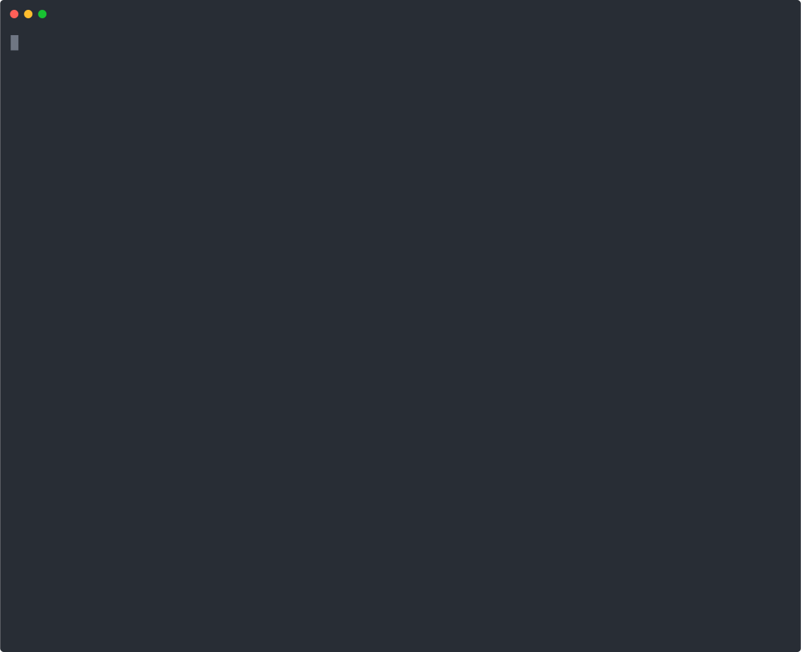

# λ OS

Control plane for [Logos](https://logos.co). Manages the module lifecycle across `logos-workspace`: snapshots submodule state, verifies modules load in a sandbox, detects available upgrades, generates proposals as patches, and gates activation through a governance layer.

Built on [Agentix](https://github.com/Beach-Bum/Agentix), a safety-first agent control layer for NixOS. λ OS extends Agentix with Logos-specific primitives: module verification via `logoscore`/`logos_host`, policy enforcement for the Logos module system, and a governance pipeline that scales from human approval to lez-multisig to LEZ programs.

Runs as a daemon on NixOS. Sends Telegram alerts. Rolls back failed modules automatically.

<p align="center">
  
</p>

*Recorded live on a NixOS machine running the daemon against a real logos-workspace with 55 submodules.*

## Status: what works and what doesn't

### Working now

- Daemon runs as a systemd service, survives reboots
- Source snapshot of 55 submodules in <1 second
- Module verification via `logos_host` in sandbox (tested with capability_module, package_manager, package_downloader)
- Self-healing: auto-rollback on module regression between cycles
- Upgrade detection: compares local pins against remote master
- Dependency-ordered proposal generation (leaves first via topological sort of `flake.nix`)
- Human governance: approve/reject/apply via CLI
- Telegram notifications on health checks, proposals, rollbacks
- Desktop notifications via `notify-send`
- Tamper-evident audit chain with `sha256` CID linking
- Policy enforcement: RLN, forbidden flake overrides, submodule drift, signed metadata (with stub keys)
- Health dashboard with uptime stats and event timeline
- 200 unit tests, 19 integration tests

### Needs upstream fixes

- `logos-workspace` master doesn't build. Requires the `bump-gazillion-things` branch (PR [#60](https://github.com/logos-co/logos-workspace/pull/60))
- `logos-liblogos` and `logos-logoscore-cli` need `autoPatchelfHook` removed (PRs [#125](https://github.com/logos-co/logos-liblogos/pull/125), [#23](https://github.com/logos-co/logos-logoscore-cli/pull/23))
- `logoscore` CLI doesn't build due to the same `autoPatchelfHook` issue — using `logos_host` as the verification backend instead

### Not yet built

- **lez-multisig governance** — interface exists, falls back to human. Needs a running LEZ instance to connect to
- **LEZ program governance** — interface exists, falls back to human. Needs LEZ program deployment tools
- **Codex audit publishing** — local hash chain works, sidecar file generated. Needs a Codex node to publish to
- **Auto-apply after governance approval** — deliberate: currently requires manual `git apply`. Could be automated but the safety contract says activation is external
- **Web dashboard** — CLI only right now. Terminal `watch` works for live display
- **C++ Qt plugin** — skeleton compiles against `logos-cpp-sdk`, MOC runs, but not yet loading in `logoscore` natively

### Deferred to later phases

- Audit verification via Codex (fetch by CID, replay, verify)
- Policy as a LEZ program (provable refusal)
- Cross-node governance (shared multisig across operators)
- Mix-layer coordination between nodes

## How it works

The daemon (`agentix-daemon`) runs a loop every N seconds:

1. **Snapshot** — captures all 55 submodule SHAs, tracked diffs, untracked file hashes
2. **Verify** — loads each module via `logos_host` with `LOGOS_USER_DIR` redirected to a temp dir
3. **Self-heal** — compares module health against previous cycle; if a module regressed, rolls back to the last known good commit
4. **Policy** — checks workspace against configurable rules (RLN for messaging modules, forbidden flake overrides, submodule drift)
5. **Detect upgrades** — compares local submodule SHAs against `origin/master`
6. **Order by dependency** — parses `flake.nix` follows declarations, proposes leaves first
7. **Generate proposals** — creates a git worktree per upgrade, pins the submodule, saves the diff as a `.patch`
8. **Submit to governance** — proposals wait in a queue until approved
9. **Notify** — Telegram message with cycle summary
10. **Audit** — appends JSONL event with full context

Proposals are never applied automatically. A human (or in the future, a lez-multisig) reviews and applies.

## Running it

### As a systemd service (NixOS)

```nix
imports = [ ./path/to/lambda-os/nixos/agentix-logos.nix ];
services.agentix-logos = {
  enable = true;
  workspacePath = "/home/user/projects/logos-workspace";
  user = "user";
  checkIntervalSec = 300;
  telegramToken = "your-bot-token";
  telegramChatId = "your-chat-id";
};
```

`nixos-rebuild switch` starts the daemon. It survives reboots.

### As a foreground process

```bash
LOGOS_WORKSPACE=~/projects/logos-workspace agentix-daemon
```

### CLI

```bash
# Node status
agentix-logos dashboard --path <workspace>

# Source integrity
agentix-logos snapshot --path <workspace>

# Module verification
agentix-logos verify-logoscore --workspace <ws> \
  --modules capability_module \
  --call "capability_module.load()" \
  --backend auto

# Policy
agentix-logos policy-check --path <workspace>

# Dependency graph
agentix-logos upgrade-plan --path <workspace>

# Governance
agentix-logos governance status --path <workspace>
agentix-logos governance list --path <workspace> --state pending
agentix-logos governance approve <proposal-id> --path <workspace>
agentix-logos governance reject <proposal-id> --reason "..." --path <workspace>
agentix-logos governance apply <proposal-id> --path <workspace>

# Audit trail
agentix-logos audit tail --path <workspace> --lines 20
agentix-logos audit verify --path <workspace>
agentix-logos audit chain --path <workspace>
```

## Setup

```bash
# Install
git clone https://github.com/Beach-Bum/lambda-os.git
cd lambda-os
uv tool install --editable .

# You also need the Agentix base CLI
git clone https://github.com/Beach-Bum/Agentix.git
cd Agentix && uv tool install --editable .

# Clone logos-workspace
git clone --recurse-submodules git@github.com:logos-co/logos-workspace.git ~/projects/logos-workspace

# Build (first time ~20-40 min)
cd ~/projects/logos-workspace
export PATH="$PWD/scripts:$PATH"
ws build logos-basecamp

# Install policy
mkdir -p .agentix
cp /path/to/lambda-os/examples/policy.json .agentix/policy.json

# Run integration test
cd /path/to/lambda-os
./scripts/integration-test.sh ~/projects/logos-workspace

# Start the daemon
LOGOS_WORKSPACE=~/projects/logos-workspace agentix-daemon
```

## Build notes

`logos-workspace` master has build issues. Use the `bump-gazillion-things` branch. `autoPatchelfHook` in `logos-liblogos` and `logos-logoscore-cli` segfaults with `pyelftools 0.32` — remove the hook from `nix/bin.nix`. PRs filed:

- [logos-co/logos-liblogos#125](https://github.com/logos-co/logos-liblogos/pull/125)
- [logos-co/logos-logoscore-cli#23](https://github.com/logos-co/logos-logoscore-cli/pull/23)
- [logos-co/logos-workspace#60](https://github.com/logos-co/logos-workspace/pull/60)

## Governance

Three backends, same interface:

| Backend | Status | Description |
|---------|--------|-------------|
| Human | Working | Proposals saved to `.agentix/proposals/`. Approved via CLI. |
| lez-multisig | Stubbed | N-of-M signatures. Falls back to human. |
| LEZ program | Stubbed | On-chain policy. Falls back to human. |

## Self-healing

If a module was healthy last cycle and fails this cycle, the daemon:

1. Finds the last good commit from audit trail / git reflog
2. Creates a worktree, reverse-pins the module, applies the patch
3. Sends a Telegram alert
4. Logs the rollback to the audit trail

No human intervention.

## Audit chain

Events appended to `.agentix/audit.jsonl`. Each line linked to the previous via `sha256` CID. `audit verify` checks integrity. `audit chain` builds a sidecar for Codex.

## Structure

```
agentix_logos/
  daemon.py           — main loop
  selfheal.py         — auto-rollback
  depgraph.py         — dependency ordering from flake.nix
  dashboard.py        — health history and stats
  proposals.py        — proposal generation
  governance.py       — approval pipeline
  notify.py           — Telegram + desktop alerts
  verify_logoscore.py — sandbox verification
  workspace.py        — snapshot and drift detection
  policy.py           — rule enforcement
  audit.py            — event writer
  audit_chain.py      — hash chain
  cli.py              — CLI commands
  modules.py          — module registry
  keys.py             — ed25519 signing
  lez.py              — LEZ program tracking
  mix.py              — Mix node config
  profiles.py         — basecamp profiles

nixos/                — NixOS systemd service
tests/                — 200 tests
scripts/              — integration test + demo
```

## Tests

```bash
uv run pytest -q           # 200 tests
uv run mypy agentix_logos/ # 0 errors
ruff check .               # 0 issues
```

## Docs

- [Architecture](docs/BRIDGE-SPEC.md)
- [Safety contract](docs/CLAUDE-LOGOS-CONTROLLER.md)
- [Policy rules](docs/POLICY-SCHEMA.md)
- [Audit schema](docs/AUDIT-SCHEMA.md)
- [Codex anchor design](docs/CODEX-AUDIT-ANCHOR.md)
- [Runbook](RUNBOOK.md)

## License

MIT
